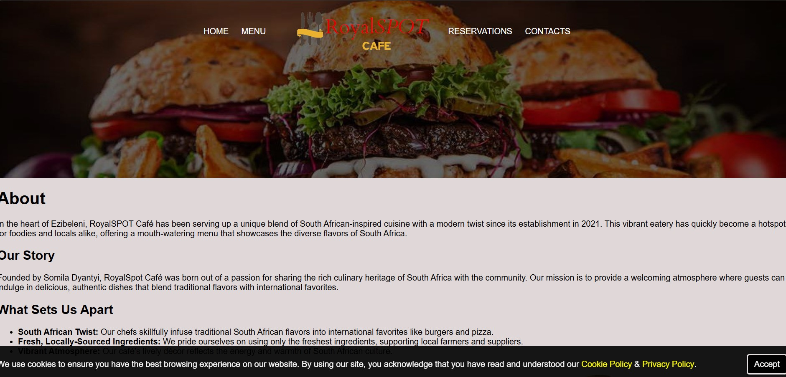

# 🍔 RoyalSpot Café - Digital Suite

A comprehensive full-stack solution for **RoyalSpot Café**. This platform manages the dual core needs of the business: **Automated Table Reservations** and a professional **WhatsApp-Integrated Ordering System**.

## 📸 Preview

  

## 🌟 Primary Systems

### 1. WhatsApp Ordering & Kitchen Flow
* **Sticky Tray:** Uses `localStorage` to ensure customer baskets aren't lost if they refresh the page or click "Modify Order."
* **Professional Receipts:** Generates a structured digital receipt with unique Order IDs (e.g., `Tbl5#102`) and Table numbers.
* **WhatsApp Integration:** Uses high-level encoding to send perfectly formatted, bolded orders directly to the kitchen with clear itemized pricing and totals.
* **Kitchen Dashboard:** A live, auto-refreshing dashboard (`Kitchen.php`) for staff to manage active orders and mark them as completed.

### 2. Reservation Management
* **Dynamic Booking Form:** Captures guest details, seating preferences (Indoor/Outdoor), and smoking requirements.
* **Automated Notifications:** Integrated with **PHPMailer** and SMTP to send instant email alerts to management for every new booking.
* **Database Tracking:** All reservations are stored securely in the MySQL traffic database for history and planning.

---

## 🛠️ Tech Stack
* **Frontend:** HTML5, CSS3, JavaScript (Basket Persistence)
* **Backend:** PHP 8.x (Dual-database architecture)
* **Database:** MySQL (Separate databases for Traffic/Reservations and Orders)
* **Security:** `.env` integration to protect sensitive SMTP and Database credentials.

## 📂 Key File Map
* `index.html` - Professional landing page and brand story.
* `menu.html` - Interactive ordering interface with the "Sticky Tray."
* `make_reservation.html` - Customer booking portal.
* `save_orders.php` - Processes orders and generates unique IDs.
* `confirmation.php` - Final receipt review and WhatsApp trigger.
* `Kitchen.php` - Live dashboard for café staff.
* `booking_processing.php` - Handles reservation logic and email dispatch.

## ⚙️ Installation
1. Clone the repository into your `laragon/www` folder.
2. Run `composer install` to set up dependencies.
3. Configure your `.env` file with your SMTP and MySQL credentials.
4. Import the provided SQL schemas into your database.
5. Access via `http://localhost/Royal/`.

---
*Developed for RoyalSpot Café - 2024*